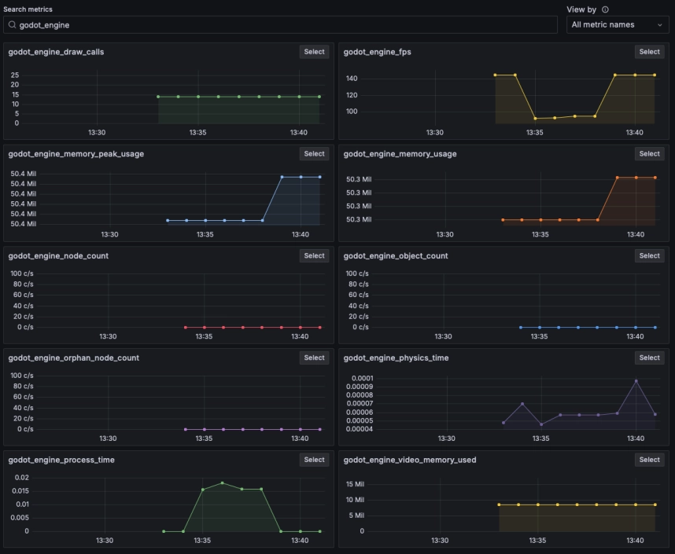

# Godot Grafana Cloud Connector

This is a simple Godot plugin for anyone that wants to send data from their Godot project to Grafana Cloud.

## Setup

### Grafana Cloud

You'll need a Grafana Cloud account. If you don’t have one, you can [sign up here](https://grafana.com/docs/grafana-cloud/get-started/).

Once logged in, navigate to **Connections** on the left, then follow the instructions below depending on whether you want to send **Metrics** or **Logs**.

---

### Metrics Setup

1. From the **Add New Connection** screen, choose `HTTP Metrics (Custom Data)`.
2. For **Metrics Format**, choose `Prometheus`.
3. Generate an API Key.
4. Copy the **URL**, **USER_ID**, and **API_KEY** to use in the Godot script.
   - Note: You might find this easier if you choose the **Python** option.

---

### Logs Setup

1. From the **Add New Connection** screen, choose `Logs Onboarding (Custom Data)`.
2. Choose **Collect, store, and manage logs in Grafana Cloud**.
3. Choose `Logs HTTP`.
4. Generate an API Key.
5. Copy the **URL**, **USER_ID**, and **API_KEY** to use in the Godot script.
   - Note: You might find this easier if you choose the **Python** option.

---

## Godot Integration

Once you download the plugin, place it in `res://addons/grafana_cloud_connector/`.

Note: The download includes an optional `examples/` folder containing a test scene to verify that your setup is working.

### Enable the Plugin

1. From the menu bar, choose **Project** -> **Project Settings**, then click the **Plugins** tab.
2. Enable the plugin, then restart Godot (or reload your project).

The plugin should now be enabled.

---

### Script Configuration

You'll need to add the information you copied from Grafana Cloud into the `loki.gd` and `prometheus.gd` scripts located at `res://addons/grafana_cloud_connector/scripts/`.

In these scripts, you can also configure the `game_name`, which will be added as a label to every metric/log, helping you organize your data in Grafana.

---

## Usage

### Metrics

To send a metric from anywhere in your project, use:

```gdscript
Grafana.prometheus.send_metric("metric_name", 123, {"Optional": "Labels"})
```

- **metric_name** (string) and **metric** (float) are required.
- **Labels** are optional but help in organizing your data in Grafana.

### Logs

To send log lines from anywhere in your project, use:

```gdscript
Grafana.loki.send_log("log line goes here", "level", {"Optional": "Labels"})
```

- **log line** is required.
- **level** and **labels** are optional, but it's recommended to add a log level for automatic categorization in Grafana.

#### Recognized Log Levels:
- `"debug"`
- `"info"`
- `"warning"`
- `"error"`

---

## Auto Instrumentation

The plugin includes a scene for automatically collecting metrics globally from the engine.

Add the scene located at `res://addons/grafana_cloud_connector/scenes/MetricsCollector.tscn` anywhere in your project. Once configured, performance metrics will be sent to Grafana every minute.

> **Note**: More frequent metrics may be possible with a paid Grafana Cloud account. This can be configured in the `EngineMetrics.gd` script.
